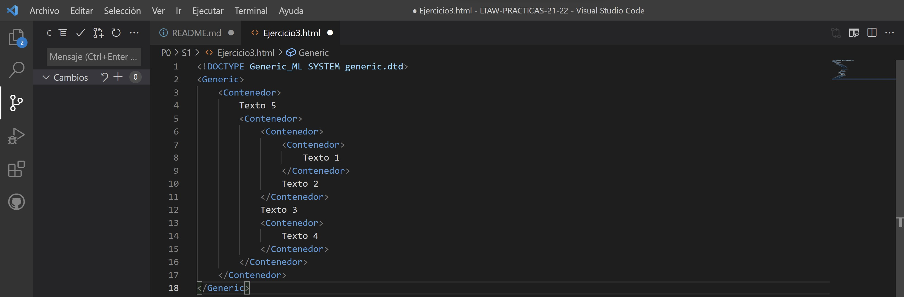

# REALIZACION DE LOS EJERCICIOS DE LA SESIÓN DE TEORIA S1  

## EJERCICIO 1
1. Explica para qué sirve la primera línea del documento y por qué es necesaria.  

 > La primera línea del código del *Ejercicio1.html*, lleva consigo la etiqueta de **!DOCTYPE [...]** definida en **SMGL**.  
 Sirve para indicar donde están las etiquetas del lenguaje  
 que estemos usando en ese momento.  
          
> En este caso, estamos utilizando un *lenguaje de marcado SMGL*,  
cuya extensión esta ubicada y definida en el sistema **"urjc_ml.dtd"**.  

2. Si se omitiese esta línea, ¿Qué piensas que ocurriría?  
 
 > Si se omitiese dicha línea, el analizador sintactico no sabría el tipo de documento en el que estamos trabajando.  

> Y por tanto, no podria analizarlo. Se produciría un error en ejecución. 

3. Sin conocer el contenido del fichero urjc_ml.dtd, ¿el documento es sintácticamente correcto?  

> En el *documento* **DTD** se encuentran definidas las etiquetas del lenguaje que estamos utilizando.  
        
> Si no tenemos conocimiento de dichas etiquetas,  
no podemos saber si las estamos usando con propiedad  
y además si son o no son validas. 
        
> Y por lo tanto, no podemos decir o afirmar con propiedad,  
si estamos ante una sintaxis valida para el **fichero DTD**  
del **Lenguaje de marcado SGML**..

4. ¿Qué hace la tercera línea?  

>La tercera línea que vemos en el código, se trata de una *imagen*, la cuál está **comentada**.  
        
>Por lo tanto, dicha línea **NO** tiene *ninguna función activa* que se pueda ejecutar alguna acción.  

5. ¿Cuantas etiquetas de apertura hay? ¿Cuantas de cierre?  

En este código que tenemos adjuntado tiene:  

> **9** etiquetas de **apertura**.  
> **9** etiquetas de **cierre**.  
> La *etiqueta inicial* **!DOCTYPE [...]**, tiene una funcionalidad especial e informativa.  
> La etiqueta comentada, se trata de una imagen, pero no tiene funcion alguna, al estar comentada.  

6. Dibuja el diagrama de contenedores de este documento.  

7. Dibuja la estructura en árbol que define este documento.  

***  
## EJERCICIO 2  
1. Escribe el documento en SMGL que representa esa estructura.  

        <!DOCTYPE urjc_ML SYSTEM "urjc_ml.dtd">
        <Universidad_Rey_Juan_Carlos>
                <Escuela>
                        <Nombre>ETSI TELECOMUNICACIÓN</Nombre>
                        <Grado1>
                                <Nombre>Ingeniería de Sistemas Audivisuales y Multimedia</Nombre>
                                <Asignatura1>LTAW</Asignatura1>
                                <Asignatura2>CSAI</Asignatura2>
                                <Asignatura3>ASA II</Asignatura3>
                        </Grado1>
                        <Grado2>
                                <Nombre>Ingeniería de Robótica Software</Nombre>
                                <Asignatura1>AC</Asignatura1>
                        </Grado2>
                </Escuela>
        </Universidad_Rey_Juan_Carlos>  

2. ¿Cuántos elementos contenedores hay? Indica sus nombres.  

Los **elementos contenedores** son aquellos que tiene en su **interior** otros elementos.  
En total hay **11 Elementos contenedores**:  
> En el **Nivel 0:** Universidad.  
> En el **Nivel 1:** Escuela.  
> En el **Nivel 2:** Nombre, Grado, y Grado.  
> En el **Nivel 3:** Nombre, Asignatura, Asignatura, Asignatura, Nombre, Asignatura

3. ¿Cuántos elementos terminales hay? Indica sus valores.  

Los **elementos terminales** son los que **NO** contienen otros elementos, ubicados al **final** de cada rama.  

**Nivel 3:**   
        1. "ETSI Telecomunicación".  

**Nivel 4:**  
        1. "Ingeniería en Sistemas Audiovisuales y Multimedia".  
        2. "LTAW".  
        3. "CSAAI".  
        4. "ASA II".  
        5.  "Ingeniería en Robótica Software". 
        6. "AC"  

4. ¿Cuantos elementos hay en el nivel 3? Escribe sus nombres.  
En el **Nivel 3** se hallan un total de **7 elementos:**  
        1. "ETSI Telecomunicación".  
        2. Nombre.  
        3. Asignatura.  
        4. Asignatura.  
        5. Asignatura.  
        6. Nombre.   
        7. Asignatura.
***
## EJERCICIO 3  
1. Escribe el documento en SGML que representa esa estructura  

2. ¿Cuántos elementos hay en total?  

Tenemos un total de **11 Elementos** en la creación de este **archivo SGML** 

3. ¿Cuántos elementos terminales hay?. Indica sus valores  

Existen **5 Elementos Terminales:**  

**Nivel 2:**  
        1. Texto 5. 

**Nivel 3**  
        1. Texto 3. 

**Nivel 4**  
        1. Texto 2.   
        2. Texto 4.   

**Nivel 5**  
        1. Texto 1. 

4. ¿Cuántos elementos no terminales hay? Indica cuántos hay en cada nivel.  

Existen **6 Elementos NO Terminales:**  

**Nivel 0**  
        1. Generic.

**Nivel 1**  
        1. Contenedor. 

**Nivel 2**  
        1. Contenedor.  

**Nivel 3**  
        1. Contenedor. 
        2. Contenedor.

**Nivel 4**  
        1. Contenedor. 

5. ¿Cuantos elementos hay en el nivel 5? Indica sus nombres  

En el **Nivel 5** solo existe un unico **Elemento de tipo Terminal**, que es:  **Texto 1**